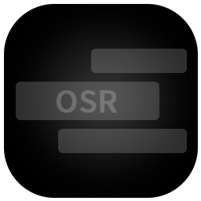
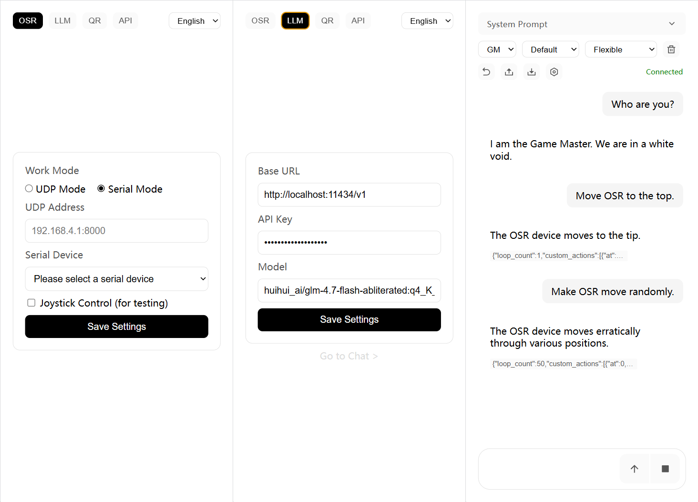

# OSRChat



OSRChat makes your OSR device smarter. It can connect to any LLM as long as it follows the OpenAI API specification. You can also connect to Ollama for local deployment, ensuring 100% privacy. Additionally, you can customize prompts to build your own conversational scenarios, similar to SillyTavern.



## Installation

### Method 1: Install using the package

Download the latest installer from the [Releases page](https://github.com/Karasukaigan/OSRChat/releases) and install it locally.

### Method 2: Deploy from source

```bash
git clone https://github.com/Karasukaigan/OSRChat.git
cd OSRChat

python -m venv venv
.\venv\Scripts\activate
pip install -r requirements.txt

python server.py
```

## Usage

0. Connect your OSR device to your computer via USB. UDP connection is also supported, but may be unstable.

1. Open OSRChat. It will run as a system tray application. You should find it in the bottom-right corner of your desktop (on Windows). Right-click the tray icon to access the menu.

2. The Settings page will automatically open in your default browser. After configuring OSR and the LLM, you can start chatting. You can also open the Chat page anytime from the tray icon menu.

3. You can also scan a QR code with your mobile device to open the chat page. The QR code is available in the QR tab on the Settings page.

## Contributing

[Issues](https://github.com/Karasukaigan/OSRChat/issues) and [Pull Requests](https://github.com/Karasukaigan/OSRChat/pulls) are welcome to help improve this project.

## License

This project is licensed under the [MIT License](./LICENSE).

## Support Development

This project is free and open source, developed and maintained in my spare time by [me](https://github.com/Karasukaigan). If you find it helpful or inspiring, please consider supporting its continued development.

Your donation helps cover development time, feature improvements, and maintenance costs.

| Ethereum | Bitcoin |
|:---:|:---:|
| 0x3E709387db900c47C6726e4CFa40A5a51bC9Fb97 | bc1qguk59xapemd3k0a8hen229av3vs5aywq9gzk6e |
|  |  |

Every contribution, no matter the amount, is greatly appreciated. Thank you for supporting open-source!